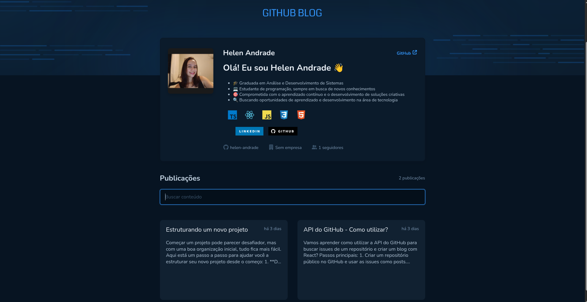
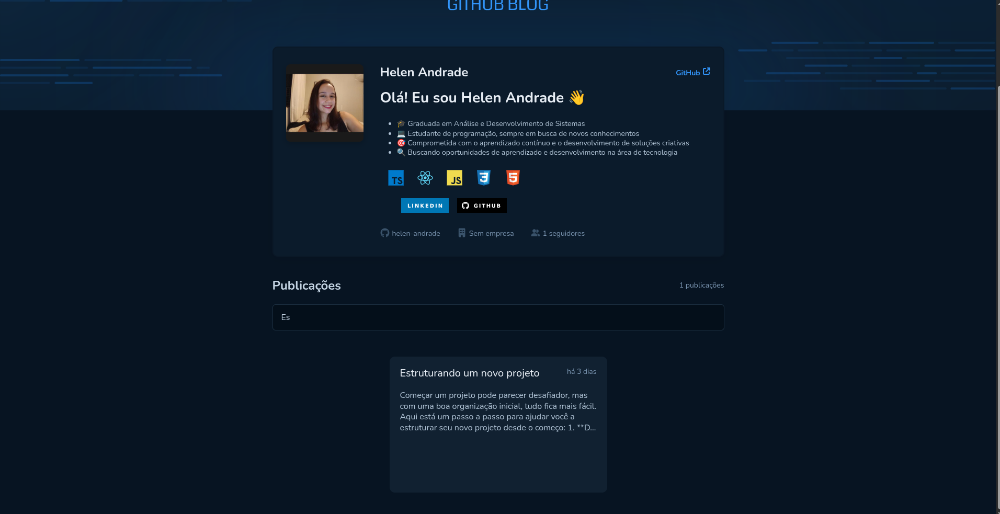
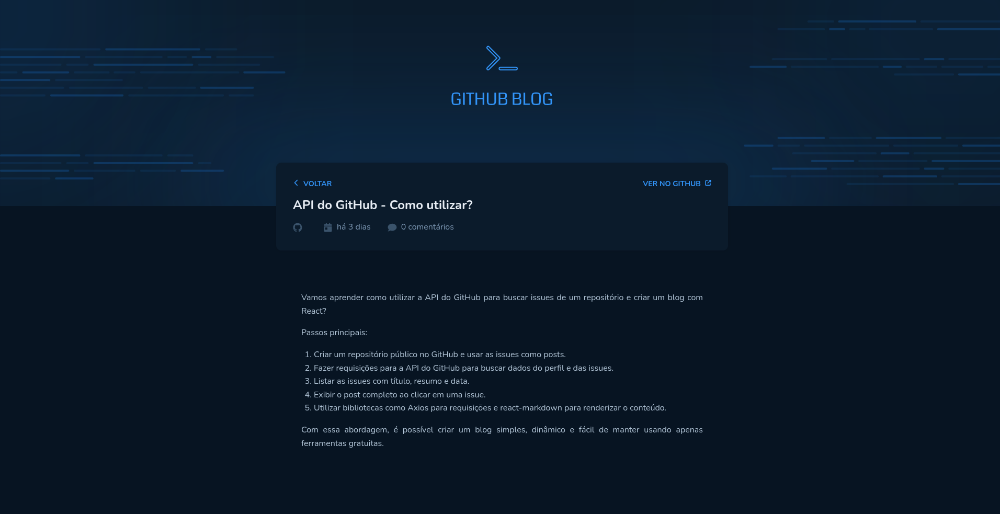

# GitHub Blog

## Esta é uma aplicação que utilizará da API do GitHub para buscar issues de um repositório, dados do perfil e as exibe como um blog.

    
    
    

# Funcionalidades

- Listagem do perfil com: imagem, número de seguidores, nome e outras informações disponíveis pela API do GitHub.

- Listar e filtrar todas as issues do repositório com um pequeno resumo do seu conteúdo.

- Página para exibir um post (issue) completo.

# Conceitos abordados

- Fetch / Axios

- Roteamento e React Router DOM

- Formulários

- Componentização

- JavaScript/TypeScript - Para lógica de programação e tipagem 

- Styled Components - Para estilização da interface

- React Hooks - Para gerenciamento de estado

# Como utilizar

1- Clone o projeto
`git@github.com:helen-andrade/github-blog.git`

2- Instale as dependências
`npm i`

3- Rode o script de desenvolvimento
`npm run dev`

---

    
Feito com ♡ por Helen Andrade

